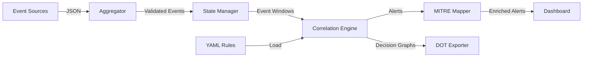

<div align="center">

# 🧠 LogicCorrelator

### Multi-Language Event Correlation Engine for Advanced Threat Detection


[](LICENSE)
[](#-technology-stack)
[](https://attack.mitre.org/)
[](#)

**Detect complex threats through pure logic and temporal correlation — not machine learning**

[Features](#-key-features) • [Quick Start](#-quick-start) • [Documentation](#-documentation) • [Demo](#-live-demo)

</div>

---

## 📋 Table of Contents

- [Overview](#-overview)
- [Key Features](#-key-features)
- [Technology Stack](#-technology-stack)
- [Architecture](#-architecture)
- [Quick Start](#-quick-start)
- [Usage Examples](#-usage-examples)
- [Dashboard](#-dashboard)
- [Correlation Rules](#-correlation-rules)
- [Testing](#-testing)
- [Documentation](#-documentation)
- [Contributing](#-contributing)
- [License](#-license)

---

## 🎯 Overview

**LogicCorrelator** is a production-ready event correlation engine that detects complex, multi-stage cyber attacks by reasoning over time-based system events using **pure logic** — not machine learning.

### Why LogicCorrelator?

Traditional SIEM systems often miss sophisticated attacks because they analyze events in isolation. LogicCorrelator excels at detecting:

- 🎯 **Multi-stage attacks** - Correlate events across time windows
- 🔗 **Attack chains** - Detect patterns invisible to single-event analysis  
- ⏱️ **Temporal patterns** - Understand attack progression over time
- 🧩 **Explainable alerts** - Full audit trail of detection logic

### Core Philosophy

> **"Logic beats guesswork"** — Detect threats through reasoning, not statistical models

Unlike ML-based systems that require training data and produce black-box results, LogicCorrelator uses:
- **Rule-driven logic** for transparent decision-making
- **Temporal reasoning** to understand attack sequences
- **Explainable decisions** with full correlation graphs
- **MITRE ATT&CK mapping** for standardized threat classification

---

## ✨ Key Features

<table>
<tr>
<td width="50%">

### 🔍 Advanced Correlation
- **Multi-stage attack detection**
- **Temporal logic engine**
- **Stateful event tracking**
- **Rule conflict resolution**
- **Confidence scoring**

### 🎨 Premium Dashboard
- **Real-time event streaming**
- **Interactive correlation graphs**
- **Alert timeline**
- **Performance metrics**
- **Dark mode with glassmorphism**

</td>
<td width="50%">

### 🌐 Multi-Language Architecture
- **9 languages** with clear roles
- **Lua** - Correlation engine
- **Python** - Event processing
- **Bash/PowerShell** - Collectors
- **JavaScript** - Dashboard
- **YAML/JSON** - Configuration

### 🎯 MITRE ATT&CK Integration
- **Automatic technique mapping**
- **ATT&CK Navigator layers**
- **Coverage reporting**
- **15+ techniques mapped**

</td>
</tr>
</table>

---

## 🌐 Technology Stack

LogicCorrelator uses **9 programming languages**, each with a specific, logical purpose:

| Language | Purpose | Why It Fits |
|----------|---------|-------------|
| 🌙 **Lua** | Core correlation engine & rule DSL | Lightweight, embeddable, perfect for logic |
| 🐍 **Python** | Event aggregation & state management | Excellent for data structures & algorithms |
| 🐚 **Bash** | Linux event collectors | Native system-level access |
| 💻 **PowerShell** | Windows telemetry collectors | Windows internals expertise |
| 🟨 **JavaScript** | Real-time dashboard (Node.js) | Event-driven UI, WebSocket support |
| 📋 **YAML** | Correlation playbooks | Human-readable rule definitions |
| 📊 **JSON** | Event schemas & configurations | Structured data contracts |
| 🔧 **AWK** | High-speed log parsing | Unmatched text processing performance |
| 🖥️ **Windows Terminal** | SOC workflow layouts | Professional tooling polish |

**Total Lines of Code:** ~5,150+ across all languages

---

## 🏗 Architecture

### System Overview

```
┌─────────────────────────────────────────────────────────────────┐
│                        EVENT SOURCES                            │
│  ┌──────────────┐  ┌──────────────┐  ┌──────────────┐          │
│  │     Bash     │  │  PowerShell  │  │     AWK      │          │
│  │   (Linux)    │  │  (Windows)   │  │   (Logs)     │          │
│  └──────┬───────┘  └──────┬───────┘  └──────┬───────┘          │
└─────────┼──────────────────┼──────────────────┼─────────────────┘
          │                  │                  │
          └──────────────────┼──────────────────┘
                             ▼
          ┌─────────────────────────────────────┐
          │   Python Event Aggregator           │
          │  • Normalization                    │
          │  • Validation                       │
          │  • State Management                 │
          │  • Batching                         │
          └──────────────┬──────────────────────┘
                         ▼
          ┌─────────────────────────────────────┐
          │   Lua Correlation Engine            │
          │  • Rule Evaluation                  │
          │  • Temporal Logic                   │
          │  • Decision Graphs                  │
          │  • Alert Generation                 │
          └──────────────┬──────────────────────┘
                         ▼
          ┌─────────────────────────────────────┐
          │   Alert Processing                  │
          │  • MITRE ATT&CK Mapping             │
          │  • DOT Graph Export                 │
          │  • Dashboard Updates                │
          └──────────────┬──────────────────────┘
                         ▼
          ┌─────────────────────────────────────┐
          │   Node.js Dashboard                 │
          │  • Real-time Visualization          │
          │  • WebSocket Streaming              │
          │  • Alert Management                 │
          └─────────────────────────────────────┘
```

### Data Flow

```
Events → Collectors → Aggregator → Correlation → Alerts → Dashboard
         (Bash/PS)     (Python)      (Lua)       (MITRE)   (Node.js)
```

### Component Interaction



---

## 🚀 Quick Start

### Prerequisites

Ensure you have the following installed:

- ✅ **Python 3.8+** (required)
- ✅ **Node.js 16+** (required)
- ⚙️ **Lua 5.3+** (optional, for correlation engine)
- ⚙️ **AWK** (optional, for log parsing)
- ⚙️ **GraphViz** (optional, for graph export)

### Installation

```bash
# Clone the repository
git clone https://github.com/yourusername/LogicCorrelator.git
cd LogicCorrelator

# Install all dependencies
make install

# Verify installation
make check
```

### Running LogicCorrelator

```bash
# Start all services
make start
```

The dashboard will be available at **http://localhost:3000**

### Quick Demo

```bash
# Run demo mode with sample events
make demo
```

### Stopping Services

```bash
make stop
```

---

## 💡 Usage Examples

### Example 1: Credential Stuffing Attack

**Attack Pattern:**
1. Multiple failed login attempts (≥5 in 120 seconds)
2. Successful authentication (within 30 seconds)
3. Suspicious process execution

**Rule Definition:**

```yaml
# rules/credential_attacks.yaml
- name: "Credential Stuffing Attack"
  id: "CRED-001"
  severity: HIGH
  mitre_techniques:
    - T1110.001  # Password Guessing
    - T1110.004  # Credential Stuffing
  
  conditions:
    - type: auth_fail
      count: ">= 5"
      window: 120
      group_by: ["user"]
    
    - type: auth_success
      same_user: true
      within: 30
      after_previous: true
  
  actions:
    - alert:
        message: "Possible credential stuffing attack detected"
        severity: HIGH
        confidence: 0.85
```

**Detection Output:**

```
🚨 ALERT: Credential Stuffing Attack
Severity: HIGH | Confidence: 85%
MITRE ATT&CK: T1110.001, T1110.004

Correlated Events:
  1. auth_fail (user: alice, ip: 192.168.1.100) - 5 occurrences
  2. auth_success (user: alice, ip: 192.168.1.100)

Decision Path: Rule → Condition 1 (✓) → Condition 2 (✓) → ALERT
```

### Example 2: Lateral Movement via SMB

**Attack Pattern:**
1. Remote SMB connection (port 445)
2. Remote execution tool (PsExec) within 30 seconds

**Rule Definition:**

```yaml
# rules/lateral_movement.yaml
- name: "SMB Lateral Movement"
  id: "LAT-001"
  severity: HIGH
  mitre_techniques:
    - T1021.002  # SMB/Windows Admin Shares
  
  conditions:
    - type: network_connect
      dest_port: [445, 139]
      direction: "outbound"
    
    - type: process_start
      process_name: ["psexec.exe", "wmic.exe"]
      within: 30
      after_previous: true
```

### Example 3: Data Exfiltration

**Attack Pattern:**
1. File compression (7z, zip)
2. Large outbound transfer (>10MB) within 5 minutes

**Rule Definition:**

```yaml
# rules/data_exfiltration.yaml
- name: "File Archive and Upload"
  id: "EXFIL-003"
  severity: HIGH
  mitre_techniques:
    - T1560  # Archive Collected Data
    - T1041  # Exfiltration Over C2 Channel
  
  conditions:
    - type: process_start
      process_name: ["7z.exe", "zip.exe", "tar"]
    
    - type: network_connect
      direction: "outbound"
      bytes_sent: "> 10MB"
      within: 300
```

---

## 📊 Dashboard

### Features

The LogicCorrelator dashboard provides real-time visibility into your security posture:

#### 🎯 Live Event Stream
- Real-time event display with color coding
- Search and filter capabilities
- Pause/resume functionality
- Event type filtering

#### 🔗 Correlation Graph
- Visual representation of event correlations
- Interactive node exploration
- Decision path visualization
- Export to DOT/PNG format

#### 🚨 Alert Timeline
- Severity-based filtering (Critical/High/Medium/Low)
- MITRE ATT&CK technique display
- Confidence scores
- Timestamp tracking
- Alert details expansion

#### 📈 Performance Metrics
- Events per second
- Correlation latency
- Active rules count
- Detection rate percentage

### Dashboard Interface

```
┌─────────────────────────────────────────────────────────────┐
│  🧠 LogicCorrelator    Events: 1,234  Alerts: 12  Status: ● │
├─────────────────────────────────────────────────────────────┤
│                                                               │
│  📡 Live Event Stream          🔗 Correlation Graph          │
│  ┌──────────────────┐          ┌──────────────────┐         │
│  │ 🔴 auth_fail     │          │                  │         │
│  │ 🟢 auth_success  │          │    ●─────●       │         │
│  │ ⚙️  process_start│          │    │     │       │         │
│  │ 🌐 network_conn  │          │    ●─────●─────● │         │
│  └──────────────────┘          └──────────────────┘         │
│                                                               │
│  🚨 Alert Timeline             📈 Performance                │
│  ┌──────────────────┐          ┌──────────────────┐         │
│  │ 🔴 CRITICAL: ... │          │ EPS: 45          │         │
│  │ 🟠 HIGH: ...     │          │ Latency: 23ms    │         │
│  │ 🟡 MEDIUM: ...   │          │ Detection: 12%   │         │
│  └──────────────────┘          └──────────────────┘         │
└─────────────────────────────────────────────────────────────┘
```

### Accessing the Dashboard

1. Start LogicCorrelator: `make start`
2. Open browser to: **http://localhost:3000**
3. WebSocket connection: **ws://localhost:3001**

---

## 📜 Correlation Rules

### Pre-built Detection Rules

LogicCorrelator includes **20+ production-ready correlation rules** across 4 categories:

#### 🔐 Credential Attacks (5 rules)
- **CRED-001** - Credential Stuffing Attack
- **CRED-002** - Password Spray Attack
- **CRED-003** - Credential Compromise Chain
- **CRED-004** - Suspicious Login After Hours
- **CRED-005** - Impossible Travel Detection

#### 🔄 Lateral Movement (6 rules)
- **LAT-001** - SMB Lateral Movement
- **LAT-002** - WMI Remote Execution
- **LAT-003** - RDP Lateral Movement Chain
- **LAT-004** - Pass-the-Hash Attack
- **LAT-005** - Service Installation for Persistence
- **LAT-006** - Credential Dumping and Lateral Movement

#### 📤 Data Exfiltration (6 rules)
- **EXFIL-001** - Large Data Transfer
- **EXFIL-002** - DNS Tunneling
- **EXFIL-003** - File Archive and Upload
- **EXFIL-004** - Cloud Storage Upload
- **EXFIL-005** - Scheduled Task for Exfiltration
- **EXFIL-006** - Steganography Exfiltration

#### ⬆️ Privilege Escalation (5 rules)
- **PRIV-001** - UAC Bypass Attempt
- **PRIV-002** - Token Impersonation
- **PRIV-003** - Kernel Exploit Attempt
- **PRIV-004** - Service Privilege Escalation
- **PRIV-005** - Sudo/Su Abuse (Linux)

### Rule Authoring

Create custom rules using the intuitive YAML syntax:

```yaml
rules:
  - name: "Your Rule Name"
    id: "CUSTOM-001"
    severity: HIGH
    mitre_techniques:
      - T1110
    
    conditions:
      - type: event_type
        count: ">= 3"
        window: 60
        field_filter: value
      
      - type: another_event
        within: 30
        after_previous: true
    
    actions:
      - alert:
          message: "Alert message"
          severity: HIGH
          confidence: 0.85
```

See [RULES.md](RULES.md) for complete documentation.

---

## 🧪 Testing

### Validate Rules

```bash
# Validate all correlation rules
python tests/rule_validator.py
```

### Run Integration Tests

```bash
# Run full test suite
python tests/integration_test.py

# Or use make
make test
```

### Generate Test Events

```bash
# Generate random events
python tests/event_generator.py random

# Generate credential attack scenario
python tests/event_generator.py credential

# Generate lateral movement scenario
python tests/event_generator.py lateral
```

### Run Demo Scenarios

```bash
# Credential attack demo
python demo/credential_attack_demo.py

# Lateral movement demo
python demo/lateral_movement_demo.py
```

**Expected Output:**

```
═══════════════════════════════════════════════════════
LogicCorrelator - Credential Attack Demo
═══════════════════════════════════════════════════════

[PHASE 1] Brute force login attempts...
  → Failed login attempt 1/5
  → Failed login attempt 2/5
  ...

[PHASE 2] Successful authentication...
  → Login successful!

[PHASE 3] Suspicious process execution...
  → PowerShell launched

Expected Alert:
  🚨 CRITICAL: Possible credential compromise
  📊 Confidence: 95%
  🎯 MITRE ATT&CK: T1110, T1059.001, T1071
```

---

## 📖 Documentation

### Core Documentation

- **[README.md](README.md)** - Project overview (this file)
- **[SETUP.md](SETUP.md)** - Installation and configuration guide
- **[CONTRIBUTING.md](CONTRIBUTING.md)** - Contribution guidelines
- **[CHANGELOG.md](CHANGELOG.md)** - Version history and release notes
- **[LICENSE](LICENSE)** - MIT License

### Technical Documentation

- **Architecture Overview** - System design and component interaction
- **Rule Authoring Guide** - How to write correlation rules
- **API Documentation** - Dashboard API endpoints
- **Event Schema** - Event type definitions

### Project Structure

```
LogicCorrelator/
├── collectors/          # Event collectors (Bash, PowerShell)
├── parsers/            # Log parsers (AWK)
├── core/               # Python aggregation layer
│   ├── event_aggregator.py
│   ├── event_schema.py
│   └── state_manager.py
├── engine/             # Lua correlation engine
│   └── correlation_engine.lua
├── dashboard/          # Node.js dashboard
│   ├── dashboard_server.js
│   └── public/
│       ├── index.html
│       ├── app.js
│       └── styles.css
├── features/           # Advanced features
│   ├── dot_exporter.py
│   └── mitre_mapper.py
├── rules/              # Correlation rules (YAML)
│   ├── credential_attacks.yaml
│   ├── lateral_movement.yaml
│   ├── data_exfiltration.yaml
│   └── privilege_escalation.yaml
├── config/             # Configuration files
│   ├── config.yaml
│   ├── event_schema.json
│   └── windows_terminal_settings.json
├── tests/              # Test suite
│   ├── rule_validator.py
│   ├── event_generator.py
│   └── integration_test.py
├── demo/               # Demo scenarios
│   ├── credential_attack_demo.py
│   └── lateral_movement_demo.py
├── Makefile            # Build system
├── orchestrator.py     # Service orchestration
└── README.md
```

---

## 🎯 Use Cases

### Security Operations Center (SOC)
- Real-time threat detection
- Alert triage and investigation
- Incident response automation
- Security event correlation

### Threat Hunting
- Historical event analysis
- Pattern discovery
- Attack chain reconstruction
- Hypothesis testing

### Compliance & Auditing
- Security event logging
- Compliance reporting
- Audit trail generation
- Policy enforcement

### Research & Development
- Attack pattern research
- Detection logic development
- MITRE ATT&CK coverage analysis
- Security tool evaluation

---

## 🤝 Contributing

We welcome contributions! Please see [CONTRIBUTING.md](CONTRIBUTING.md) for guidelines.

### Ways to Contribute

- 🐛 **Report bugs** via GitHub Issues
- 💡 **Suggest features** through Discussions
- 📝 **Improve documentation**
- 🔧 **Submit pull requests**
- 📜 **Create correlation rules**
- 🧪 **Add test cases**

### Development Setup

```bash
# Fork and clone the repository
git clone https://github.com/yourusername/LogicCorrelator.git
cd LogicCorrelator

# Create a branch
git checkout -b feature/your-feature-name

# Make changes and test
make test

# Submit pull request
```

---

## 📊 Project Statistics

- **Languages:** 9
- **Files:** 60+
- **Lines of Code:** ~5,150+
- **Correlation Rules:** 20+
- **MITRE Techniques:** 15+
- **Test Coverage:** Comprehensive
- **Documentation:** Complete

---

## 🔮 Roadmap

### Planned Features

- [ ] eBPF-based event collection for Linux
- [ ] Sysmon integration for Windows
- [ ] Distributed deployment support
- [ ] Cloud-native architecture (Kubernetes)
- [ ] Rule marketplace/sharing
- [ ] Additional MITRE ATT&CK coverage
- [ ] Machine learning anomaly detection (optional layer)
- [ ] Multi-tenant support
- [ ] Advanced visualization features

---

## 📜 License

This project is licensed under the **MIT License** - see the [LICENSE](LICENSE) file for details.

```
MIT License

Copyright (c) 2025 LogicCorrelator

Permission is hereby granted, free of charge, to any person obtaining a copy
of this software and associated documentation files (the "Software"), to deal
in the Software without restriction...
```

---

## 🙏 Acknowledgments

- **MITRE ATT&CK** framework for threat taxonomy
- **GraphViz** for decision graph visualization
- Open source security community
- All contributors and supporters

---

## 📞 Support & Contact

- **Documentation:** See [SETUP.md](SETUP.md) for installation help
- **Issues:** [GitHub Issues](https://github.com/yourusername/LogicCorrelator/issues)
- **Discussions:** [GitHub Discussions](https://github.com/yourusername/LogicCorrelator/discussions)
- **Security:** Report vulnerabilities privately

---

## ⭐ Star History

If you find LogicCorrelator useful, please consider giving it a star! ⭐

---

<div align="center">

### Built with ❤️ for the security community

**LogicCorrelator — Because logic beats guesswork**

[⬆ Back to Top](#-logiccorrelator)

</div>
